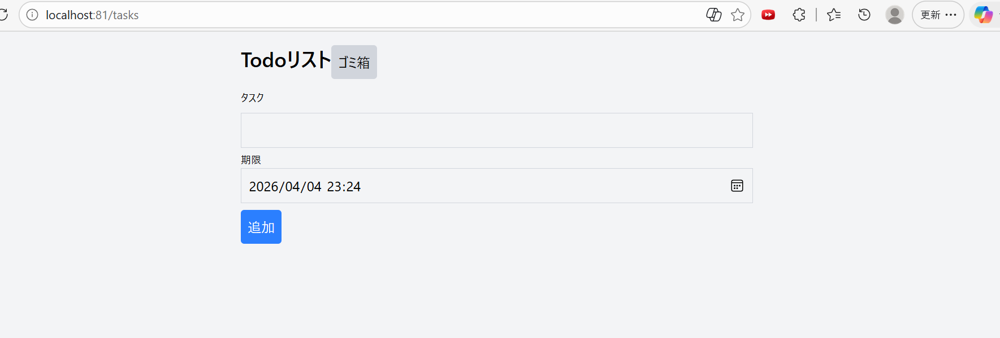
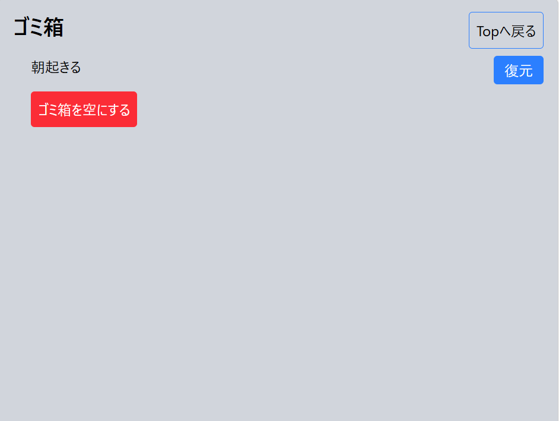

# Todoアプリ（Laravel）

## 概要
Laravelを用いてTodo管理アプリを作成しました。

## 機能
- タスク追加
- 期限設定
- 完了（Done）
- ゴミ箱機能
- 復元機能
- ゴミ箱の完全削除

## 使用技術
- Laravel
- Tailwind CSS
- MySQL

## 工夫した点
- ゴミ箱機能を実装し、削除と復元を両立
- TailwindでシンプルなUI構築

## 今後の改善
- 編集機能
- 並び替え機能
## 画面

### 一覧画面

### ゴミ箱画面

